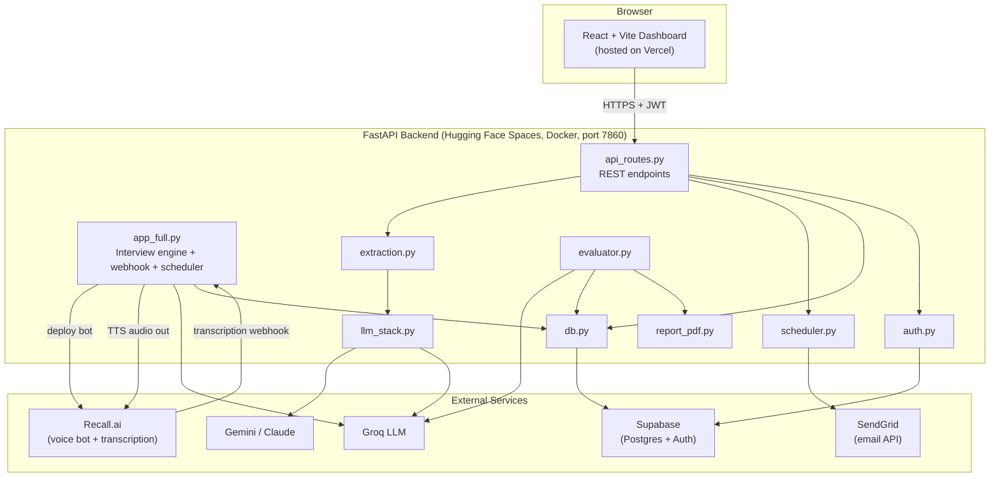
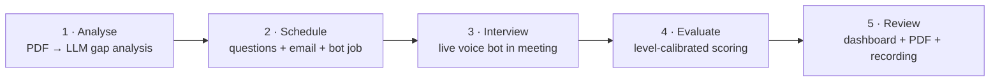
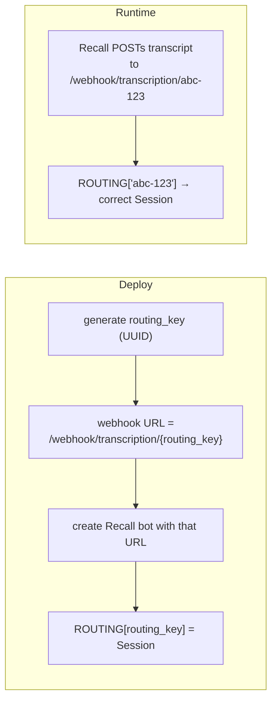
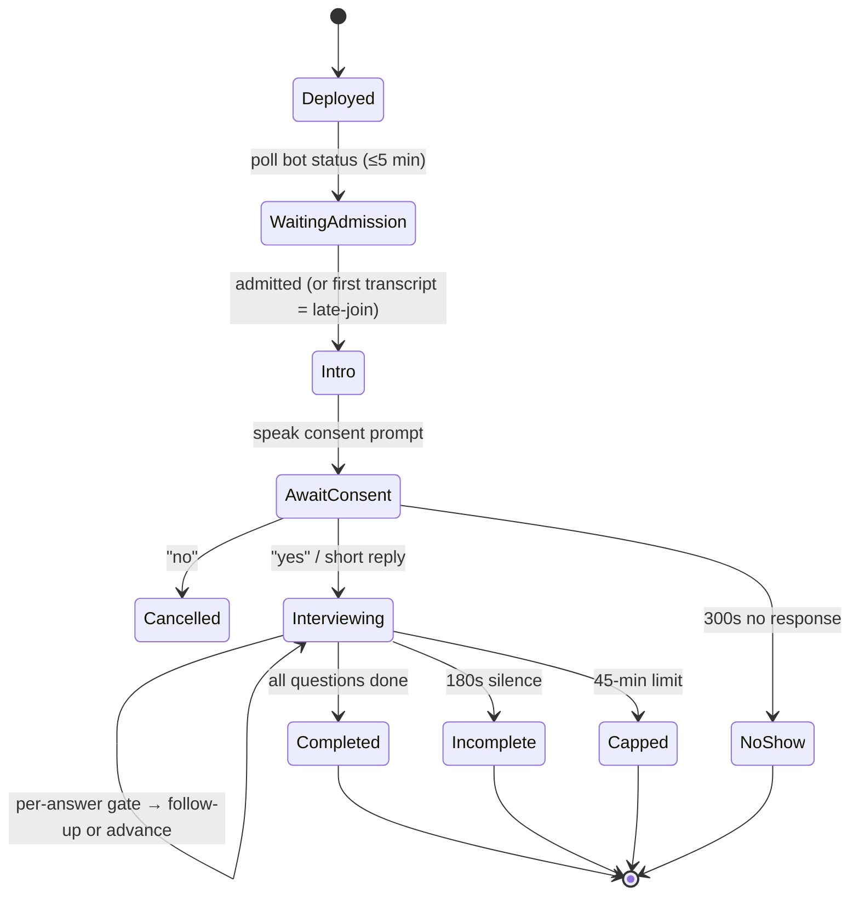
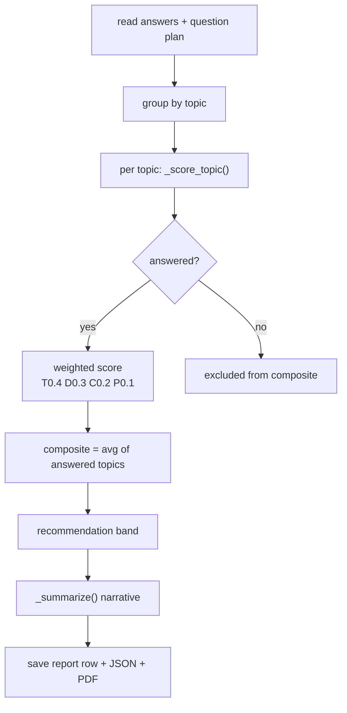
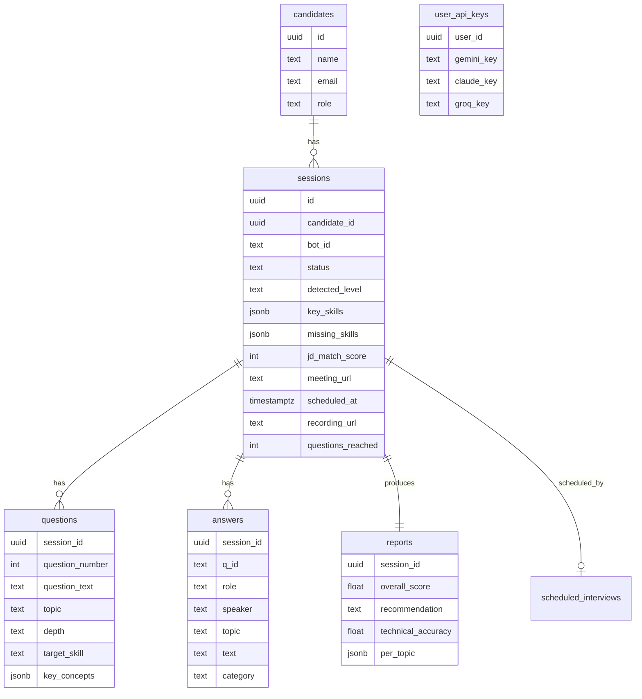

# Belvio — AI Interview Agent · Project Report

> **Version:** Post-deployment iteration (updated after Hugging Face + Vercel launch and the scoring/recording/email fixes).
> **Audience:** Engineers (low-level "how it works") **and** stakeholders (application-level "what it does and why").
> **One-line definition:** An autonomous platform that takes a résumé + job description, conducts a *live voice interview* with a candidate through a meeting bot, then scores it and produces a hiring report — with no human interviewer in the loop.

---

## 1. What Belvio Is (Application Level)

Belvio replaces the first-round technical screen. An HR user uploads two PDFs (résumé + JD). The system:

1. **Analyses** the documents — extracts the candidate's identity, experience level, skills, and the gap between what the JD wants and what the résumé shows.
2. **Generates** a tailored, level-appropriate question plan and **emails** the candidate a meeting invite.
3. At the scheduled time, a **voice bot joins** the Teams/Meet/Zoom call, asks for consent, conducts the full interview (with live follow-ups), and handles silence/no-shows/time limits.
4. **Evaluates** every answer on four weighted dimensions, calibrated to the candidate's level, and writes a recommendation.
5. Presents the HR user a **dashboard** with scores, transcript, recording, and a downloadable PDF.

The defining technical characteristic: **it is real-time and concurrent.** Multiple interviews can run at once, each a live spoken conversation, each isolated from the others.

---

## 2. The User Story (End-to-End)

> *As an HR user, I upload Khushi's résumé and the Business Analyst JD. Belvio tells me she's an intermediate candidate, strong in data analysis, light on Agile. I accept the auto-suggested role, set the bot to join in 10 minutes, and click Schedule. Khushi gets an email with a Google Meet link. At the scheduled time a bot joins the call, asks her consent, and runs a 10-topic interview — opening with her background, following up on a project she mentions, probing the Agile gap, and adapting when she answers a later question early. When she's done, the bot leaves. A few minutes later I open the dashboard: composite 6.5/10, "Recommended", per-topic breakdown, the full transcript, and an audio recording I can play. I download the PDF and forward it to the hiring manager.*

Every clause in that story maps to a concrete subsystem, described below.

---

## 3. System Architecture



**Two deploy targets:**
- **Frontend → Vercel** (static React build). Talks to the backend via `VITE_API_URL`.
- **Backend → Hugging Face Spaces** (Docker container). Holds the engine, the scheduler thread, and the public webhook URL that Recall calls back.

---

## 4. Tech Stack (Objective)

| Layer | Technology | Why this choice |
|---|---|---|
| Backend API | FastAPI (Python) | Async, simple, first-class `UploadFile`/`Request`; runs one process that also hosts background threads |
| Voice bot | Recall.ai | Abstracts Teams/Meet/Zoom joining, recording, and streaming transcription behind one API |
| Text-to-Speech | gTTS (Google TTS) | Free, no key; returns MP3 we base64-encode and push to Recall's `output_audio` |
| Live-reasoning LLM | Groq `llama-3.1-8b-instant` | **Lowest latency** — needed for turn detection / gating during a live conversation |
| Evaluation LLM | Groq `llama-3.3-70b-versatile` | **Higher rigor** — runs once at the end where latency is hidden |
| Analysis/question LLM | Gemini → Claude → Groq fallback | Best structured-extraction quality in our testing; chain survives a provider outage |
| Database | Supabase (Postgres) | Managed Postgres + built-in Auth in one service |
| Auth | Supabase JWT, verified locally | No per-request network call (see §10) |
| Email | SendGrid HTTP API (Gmail SMTP fallback) | SMTP is blocked in cloud hosting (see §11) |
| PDF | reportlab | Pure-Python, no system deps in the container |
| Frontend | React 18 + Vite | Fast dev, simple static build for Vercel |
| Hosting | HF Spaces (backend) + Vercel (frontend) | Free, public URLs; HF gives the always-on webhook endpoint Recall needs |

---

## 5. The Five Lifecycle Stages



Each stage is owned by specific modules:

| Stage | Owns it | Produces |
|---|---|---|
| Analyse | `extraction.analyze_documents` via `llm_stack` | `analysis` dict (name, email, level, skills, gaps) |
| Schedule | `api_routes /api/schedule` + `extraction.generate_question_plan` + `scheduler.send_invite` + `db` | `session` row (`scheduled`), `questions`, `scheduled_interviews` row, email |
| Interview | `app_full.py` (engine + webhook) + Recall + gTTS + Groq | `answers` transcript rows, recording |
| Evaluate | `evaluator.evaluate_session` + `report_pdf` | `reports` row + PDF |
| Review | `api_routes /api/hr/*` + React pages | dashboard views, PDF download |

---

## 6. Module-by-Module: How Each `.py` File Works

### `app_full.py` — the live interview engine (the heart)
The largest and most stateful file. Responsibilities:

- **`Session` class** — one instance per live interview, holding *all* mutable state: `bot_id`, `session_id`, the question list, `question_index`, follow-up flags, `interview_started/over`, `completion_status`, the running `transcript`, `covered_concepts`, timers, and per-session `threading.Lock`s so concurrent interviews never corrupt each other.
- **Registries** — `SESSIONS` (`bot_id → Session`), `ROUTING` (`routing_key → Session`), and `COMPLETED` (`routing_key → session_id`, kept after a session ends so a late recording lookup can still resolve it). All mutations are guarded by `_registry_lock`.
- **`speak()`** — converts text to MP3 via gTTS, base64-encodes it, and POSTs to Recall's `output_audio`. Serialized per session with `speak_lock` so audio never overlaps; retries once on Recall's `cannot_command_unstarted_bot` (bot admitted but not "ready" yet).
- **`deploy_bot()`** — creates the Recall bot with a pre-generated UUID `routing_key` embedded in the webhook URL (see §7), loads that candidate's questions from the DB, registers the `Session`, and starts the admission poller.
- **`wait_for_join_and_speak()`** — polls bot status up to 5 minutes; when admitted, speaks the consent intro and starts the no-show watchdog. (Late admission is handled separately by the webhook — see below.)
- **Webhook `handle_transcription()`** — the single endpoint Recall streams transcription to. It routes by `routing_key`, handles late-join (speak intro on first transcript if the poller missed it), consent detection, meta-commands ("repeat", "rephrase", "give me a moment"), and feeds real answers into the turn engine.
- **Turn engine** — `schedule_processing` → `run_gate_check` → `process_answer` → `advance`. Detects when the candidate has finished speaking (`turn_verdict`), gates the answer's quality (`gate_answer`), decides on a follow-up, and moves to the next question. (Detailed in §8.)
- **Watchdogs** (one thread each, per session): `no_show_watchdog` (300s for consent), `silence_end_watchdog` (180s of dead air → close incomplete), `cap_watchdog` (45-min hard limit), and `stuck_session_cleaner` (process-wide; closes sessions stuck `in_progress` > 2h).
- **`fetch_and_save_recording()`** — after the call, polls Recall for up to 10 minutes and **recursively** searches the recording object for a `download_url` (the nesting key varies by recording config), then saves it to the session.
- **`scheduler_worker()`** — a background thread that polls the DB every 30s for due scheduled interviews and deploys their bots.
- Top of file sets **`sys.stdout.reconfigure(encoding="utf-8")`** so emoji log lines don't crash Windows consoles (see §11).

### `extraction.py` — document understanding + question planning
- **`extract_text()`** — pulls raw text from a PDF with `pypdf`. No OCR, so scanned/image PDFs yield nothing.
- **`analyze_documents()`** — one LLM call (Gemini-first chain) that returns a strict JSON analysis: candidate name/email, `detectedLevel` (fresher <1yr / intermediate 1-5 / experienced 5+), skills, technical stack, `missingSkills` (JD-vs-résumé gap), `jdMatchScore`, and a short briefing.
- **`generate_question_plan()`** — builds the interview. It picks a **level-specific module flow** (fresher vs experienced get different blueprints), enforces **difficulty progression** (surface → medium → deep), and a **source-mapping rule**: surface/medium questions are grounded in the résumé (catch a bluffer), deep questions target the *missing* skills (test adaptability). Each question carries `topic`, `question_type`, `depth`, `target_skill`, and `key_concepts`. Falls back to a static question set if generation fails.

### `llm_stack.py` — multi-provider LLM layer
- Defines **two fallback chains**: `parsing` = Gemini → Claude → Groq (quality), `realtime` = Groq → Gemini → Claude (speed).
- `call()` tries each provider in order; on a rate/quota error it falls back, and if *every* available provider is rate-limited it raises **`LLMExhausted`** so the UI can ask the user to add a fresh key.
- `call_json()` wraps `call()` with tolerant JSON parsing (strips code fences, grabs the first `{...}`/`[...]`).
- Accepts per-user API keys (from the encrypted key store) or falls back to env vars.

### `evaluator.py` — final scoring (recently overhauled)
- **`_group_by_topic()`** — assembles transcript rows back into per-topic `{question, answer, followup_q, followup_a, categories}` blocks.
- **`_score_topic()`** — scores one topic 1-10 on four dimensions (Technical 40% / Depth 30% / Clarity 20% / Problem-Solving 10%). **Recent change:** the prompt now includes (a) explicit behavioral **score anchors** (what a 5 vs a 7 looks like), (b) a **level-calibration** line so a strong fresher isn't judged like a weak senior, and (c) the question's **`key_concepts` as an explicit answer key** that drives the accuracy/depth scores.
- **`_calibration()`** — returns the level-specific baseline instruction (fresher / intermediate / experienced).
- **`_recommendation()`** — maps composite to bands: ≥8 Strongly, ≥6.5 Recommended, ≥5 Needs Review, else Not Recommended.
- **`evaluate_session()`** — the entry point. Reads answers, builds the `{topic: key_concepts}` map from the stored plan, scores each answered topic, averages **answered topics only** (so unreached questions in an incomplete interview don't drag the score down), writes the `reports` row, dumps a JSON backup, and renders the PDF.

### `scheduler.py` — invitations + (optional) meeting creation
- **`send_invite()`** — tries **SendGrid HTTP API** first (works in cloud, no SMTP ports), falls back to **Gmail SMTP** (465 → 587 STARTTLS) for local runs. Fail-safe: returns `True/False`, never throws into the caller.
- **`create_google_meet()`** — optional Google Calendar API integration (full read/write: create/update/delete events with a Meet link). Gated behind a one-time OAuth setup; imported lazily so a missing dependency never breaks the app.

### `report_pdf.py` — the HR PDF
- `build_report_pdf()` renders a reportlab document: header, recommendation banner, 4-dimension table, **per-topic table** (the `Note` cell is now wrapped in a `Paragraph` so long notes no longer overflow the page), strengths/gaps/justification, and the full transcript on a new page.

### `db.py` — Supabase persistence (fail-safe by design)
- Every function degrades safely: if Supabase is unreachable it logs and returns `None`/`[]` so a live interview is **never** interrupted by a DB hiccup (the local JSON transcript is the backup).
- Covers sessions, candidates, questions, answers, reports, scheduled interviews, and the dashboard read-models (`list_sessions_with_reports`, `get_session_full`, `_pair_transcript`).
- **Recent additions:** `get_session_context` now also returns `detected_level` (needed by the calibrated scorer); `list_stuck_sessions` + `get_session_id_by_bot_id` support orphaned-session recovery.

### `auth.py` — JWT + encrypted key vault
- **`verify_token()`** — validates the Supabase JWT by **decoding the payload locally** (base64url) — no network round-trip per request.
- **API-key vault** — per-user Gemini/Claude/Groq keys are **Fernet-encrypted at rest**, decrypted only server-side for LLM calls, and only ever returned to the UI **masked** (`sk-…wx9f`).

### `api_routes.py` — the REST contract
The single FastAPI router the frontend talks to:

| Method + Path | Purpose |
|---|---|
| `POST /api/auth/login` | Sign in via Supabase, return JWT |
| `POST /api/analyse` | Upload résumé/JD PDFs → analysis |
| `POST /api/schedule` | Generate questions, store session, email invite, queue the bot |
| `GET /api/hr/sessions` | Dashboard list (joined with report recommendation/score) |
| `GET /api/hr/session/{id}` | Full nested detail (session + questions + paired transcript + report) |
| `GET /api/hr/report/{id}` | Report row |
| `GET /api/hr/report/{id}/pdf` | Generate + download the PDF |
| `GET`/`POST /api/keys` | Masked read / encrypted write of per-user LLM keys |

---

## 7. Concurrency Model — Why `routing_key` Exists

The hardest correctness problem: **Recall's realtime transcription webhooks do *not* include a bot ID.** With multiple interviews live at once, the backend can't tell which conversation a transcript belongs to.

**Solution:** pre-generate a UUID *before* creating the bot, embed it in the webhook URL path, and map it to the session.



Every interview thus has a private inbox. `SESSIONS` (by `bot_id`) is kept for status polling and teardown; `ROUTING` (by `routing_key`) is the authoritative router for live webhooks.

---

## 8. The Live Interview Engine (Low-Level)



**Per-answer micro-loop** (the part that makes it feel human):

1. **Turn detection (`turn_verdict`)** — is the candidate done speaking, mid-sentence, or unsure? Uses a 2s silence gate plus a fast LLM check, with a `MAX_TURN_WAIT` ceiling so it never hangs.
2. **Quality gate (`gate_answer`)** — classifies the answer as `strong` / `thin` / `vague` / `off_topic`, and records which key concepts were genuinely demonstrated.
3. **Follow-up decision:**
   - **Intro question** → *always* a purposeful, **project-focused** follow-up (recent change — no longer a random gate-based prompt).
   - **Other questions** → one follow-up only if the answer wasn't `strong`.
4. **Cross-question check (`check_if_already_answered`)** — if the candidate already covered the next topic, the bot acknowledges and asks a deeper adjusted question instead of repeating.
5. **`advance()`** — moves to the next question with a natural transition line, or ends the interview.

All LLM calls here use the **fast** `8b-instant` model — latency is felt by the candidate, so speed beats rigor at this stage.

---

## 9. Scoring & Evaluation (Low-Level, Recently Reworked)



**The problem we fixed:** the original scorer said "be STRICT, most answers are not 9-10" with **no definition of what a 5 vs a 7 looks like**, and graded everyone on one **absolute** scale. Result: good freshers scored like weak seniors and landed "Not Recommended."

**The fix (chosen over a heavier per-question rubric):**
- **Anchored bands** — the prompt now defines each score band behaviorally (9-10 = demonstrates + trade-offs; 5-6 = names concepts, shallow; etc.).
- **Level calibration** — the scorer is told the candidate's level and the baseline to grade against. A strong answer *for that level* lands 7-8.
- **`key_concepts` as the answer key** — we already generated these at plan time; the scorer now actually uses them to drive accuracy/depth, instead of improvising criteria.

> Trade-off accepted: "Recommended" is now **level-relative** — a strong fresher and a strong senior can both reach it, judged against different baselines. The report shows the level, so it's transparent. We kept the score bands as-is (Option A); only if good candidates still under-score would we lower the thresholds (Option B).

---

## 10. Key Design Decisions & Why

| Decision | Reasoning |
|---|---|
| **UUID `routing_key` in webhook URL** | Recall realtime webhooks omit `bot_id`; this is the only concurrency-safe way to route transcripts to the right interview |
| **Two LLM tiers** | Live gating needs speed (`8b-instant`); final scoring needs rigor (`70b-versatile`) and can afford latency |
| **Provider fallback chain** | A single provider's rate-limit shouldn't kill analysis; chain + `LLMExhausted` gives graceful degradation |
| **Fail-safe DB layer** | A live spoken interview must never crash because Supabase blinked; local JSON is the backup |
| **Local JWT decode (no network)** | Faster, and avoided an SDK incompatibility we hit with the service-role key format |
| **Auth moved to backend `/api/auth/login`** | The browser must never hold the Supabase service key ("Forbidden use of secret API key in browser") |
| **Composite over *answered* topics only** | Incomplete interviews shouldn't be punished for questions never reached |
| **Watchdog threads, not cron** | Each interview self-manages its own timeouts in-process; simplest reliable model for a single container |

---

## 11. Deployment Journey — What We Tested, What Broke, Why We Changed It

This section captures the real engineering history, not just the final state.

| Symptom in the wild | Root cause | What we changed |
|---|---|---|
| Recording URL never saved | 45-second retry window too short; Recall processing takes minutes | Extended to a 20 × 30s (10-min) poll |
| Bot never spoke in Google Meet | Bot waits in lobby; 90s admission poll expired before the host admitted it | Extended admission poll to 5 min **+** added a late-join path in the webhook (speak intro on first transcript) |
| `cannot_command_unstarted_bot` 400 | Bot admitted but not yet "ready" for audio | `speak()` retries once after a short delay |
| 401 on every API call | `db.auth.get_user(token)` failed with the key format | Replaced with **local base64url JWT decode** |
| "Forbidden use of secret API key in browser" | Supabase service key was shipped to the frontend | Removed Supabase client from the browser; added backend `/api/auth/login` |
| Email "Not sent": `[Errno 101] Network unreachable` | **HF Spaces blocks outbound SMTP (25/465/587)** to prevent spam abuse | Switched to **SendGrid HTTP API** (port 443, never blocked); SMTP kept as local fallback |
| SendGrid `400 Invalid from email address` | Sender not verified | Documented SendGrid **Single Sender Verification** (works with a plain Gmail, no domain) |
| Bot deploy `400 Invalid Webhook URL` | `NGROK_URL` not pointing to the public HF URL in cloud | Set `NGROK_URL` = the HF Space URL |
| `recording.done is not a valid choice` | Lifecycle events are **not** valid in per-bot `realtime_endpoints` — they go to the account-level webhook | Reverted to polling for the recording (the reliable path without dashboard config) |
| Recording done but URL "not ready" forever | Hardcoded path `media_shortcuts.audio_mixed.data.download_url` didn't match the real shape | **Recursive search** for any `download_url`; log the real `media_shortcuts` shape |
| `module 'db' has no attribute 'list_stuck_sessions'` spamming logs | `app_full.py` was pushed but `db.py` changes weren't committed | Commit both together (deploy is git-push to HF) |
| Emoji log lines crash on a teammate's Windows | Windows console is cp1252; emoji `print()` raises `UnicodeEncodeError` | Force `sys.stdout.reconfigure(encoding="utf-8")` at startup |
| PDF "Note" text runs off the page | reportlab doesn't wrap plain strings in table cells | Wrap the cell in a `Paragraph` |
| Intro follow-up felt random | Generic gate-based follow-up on the opening question | Dedicated **project-focused** intro follow-up |
| Every candidate scored low / rejected | Strict prompt + no anchors + level-blind absolute scale | **Anchored bands + level calibration + key_concepts** (see §9) |

**Why Hugging Face + Docker at all?** The bot needs a *public, always-on* URL for Recall to call back. Running locally meant keeping a laptop + ngrok tunnel alive forever. HF Spaces (Docker, port 7860) gives a permanent public endpoint; the `Dockerfile` just installs `requirements.txt` and runs `uvicorn app_full:app`. **Why Vercel for the frontend?** Static React build, instant global hosting, points at the HF backend via `VITE_API_URL`.

---

## 12. Data Model (Supabase / Postgres)



*Note:* `sessions` denormalizes `candidate_name/email/role` alongside the `candidate_id` FK for fast dashboard reads. `answers.role` is the transcript role (`question`/`answer`/`followup_*`/`intro`/`closing`), distinct from the candidate's job role.

---

## 13. Environment Variables

| Variable | Used by | Notes |
|---|---|---|
| `RECALLAI_API_KEY` | engine | Recall bot + recording |
| `RECALL_REGION` | engine | defaults to `ap-northeast-1` |
| `NGROK_URL` | engine | **public** base URL for webhooks — on HF set it to the Space URL |
| `GROQ_API_KEY` | engine, evaluator, llm_stack | required |
| `GEMINI_API_KEY` / `ANTHROPIC_API_KEY` | llm_stack | analysis/question chain |
| `SUPABASE_URL` / `SUPABASE_KEY` | db, auth, api_routes | service-role key, server-side only |
| `APP_ENCRYPTION_KEY` | auth | Fernet key for the API-key vault |
| `SENDGRID_API_KEY` / `SENDGRID_FROM_EMAIL` | scheduler | cloud email (verified sender) |
| `GMAIL_ADDRESS` / `GMAIL_APP_PASSWORD` | scheduler | local SMTP fallback |
| `VITE_API_URL` | frontend | points the React app at the backend |

---

## 14. Implementation / Run Steps

### Local development
```bash
# 1. Backend
python -m venv .venv
.venv\Scripts\activate            # Windows
pip install -r requirements.txt
cp .env.example .env              # fill in keys

# Expose a public URL for Recall webhooks
ngrok http 8000                   # copy the https URL into NGROK_URL

python app_full.py                # backend on :8000

# 2. Frontend (separate terminal)
cd frontend
npm install
npm run dev                       # dashboard on :3000
```

### Deploy an update
```bash
git add <changed files>
git commit -m "feat/fix: ..."
git push origin main              # GitHub (source of truth)
git push hf main                  # Hugging Face (auto-rebuilds the Docker image)
# Frontend: Vercel auto-deploys on push to the connected repo/branch
```

### Cloud configuration checklist
1. **HF Spaces → Settings → Variables & Secrets:** all keys from §13, with `NGROK_URL` = the Space's own public URL.
2. **SendGrid:** verify a Single Sender (a plain Gmail works), set `SENDGRID_API_KEY` + `SENDGRID_FROM_EMAIL`.
3. **Supabase:** create the tables in §12 plus `user_api_keys` (schema in `auth.py`), and create the HR login user.
4. **Vercel:** set `VITE_API_URL` to the HF backend URL.

---

## 15. Known Constraints & Roadmap

**Constraints**
- PDF parsing is text-only (no OCR for scanned résumés).
- Recall recording URLs are temporary pre-signed S3 links (expire) — for permanence they'd need copying to durable storage.
- Google Meet bots wait in the lobby; the host must admit them.
- Lifecycle events (`bot.done`/`recording.done`) require the account-level Recall webhook to be configured for fully instant session-close; today we poll, which is reliable but not instantaneous.
- Free Groq tier throughput caps comfortable concurrency at roughly 3-5 simultaneous live interviews.

**Roadmap (discussed, not yet built)**
- **Skill-targeted live follow-ups** (#7) — feed the failed question's `target_skill` into the follow-up so it steers to the specific JD gap.
- **Question distribution percentages** (#2) per level (e.g. 50% technical for freshers).
- **Pre-generated Excellent/Good/Poor rubric** per question (#5) — deferred; the calibrated scorer + `key_concepts` covers the immediate need.
- **Instant session-close** via the account-level lifecycle webhook (replacing the poll).
- **Durable recording storage** (copy the S3 file before the link expires).

---

*End of report.*
